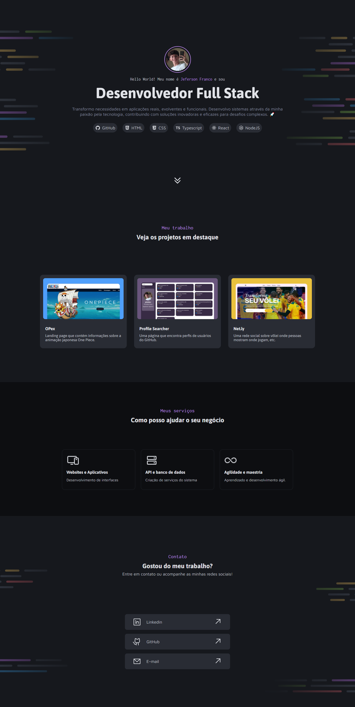

# 🏖 Meu Portfólio | Rocketseat

Portfólio do desafio prático de HTML/CSS da **Rocketseat**. Apesar de já possuir conhecimentos prévios de HTML e CSS, optei por ver o módulo para que eu pudesse rever algumas coisas e talvez descobrir alguma coisa que eu não sabia.

## Autor

 
 
 <b> Jeferson Franco, Desenvolvedor Full Stack </b> 
 
 

